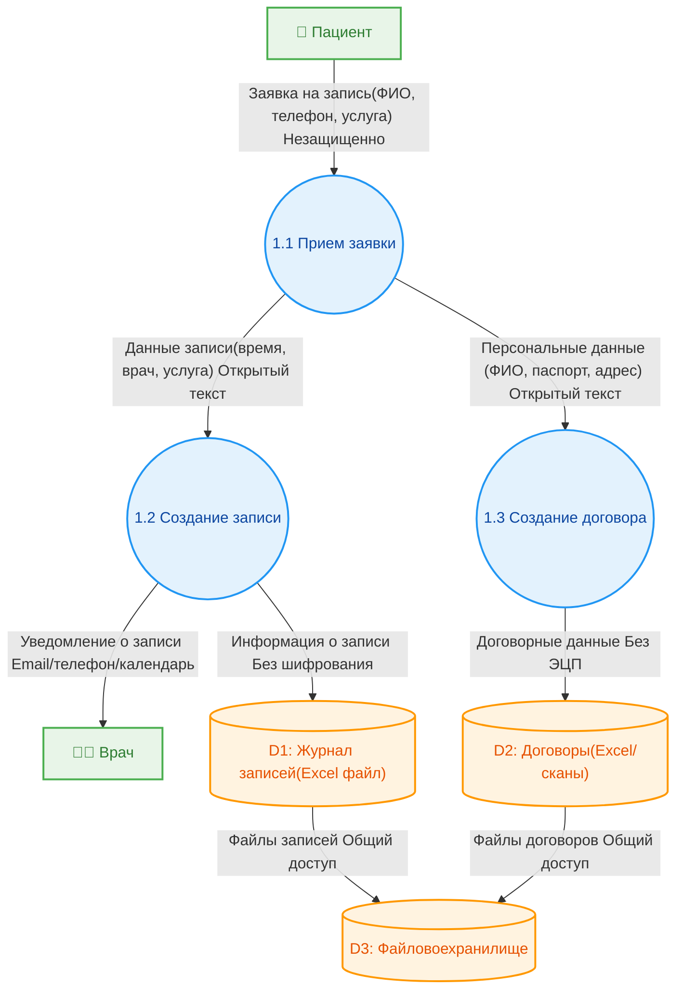
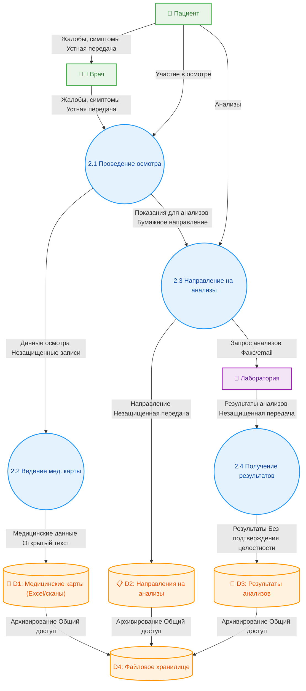
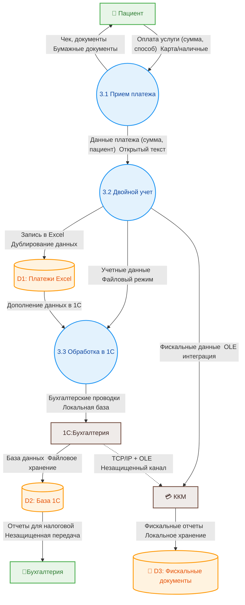
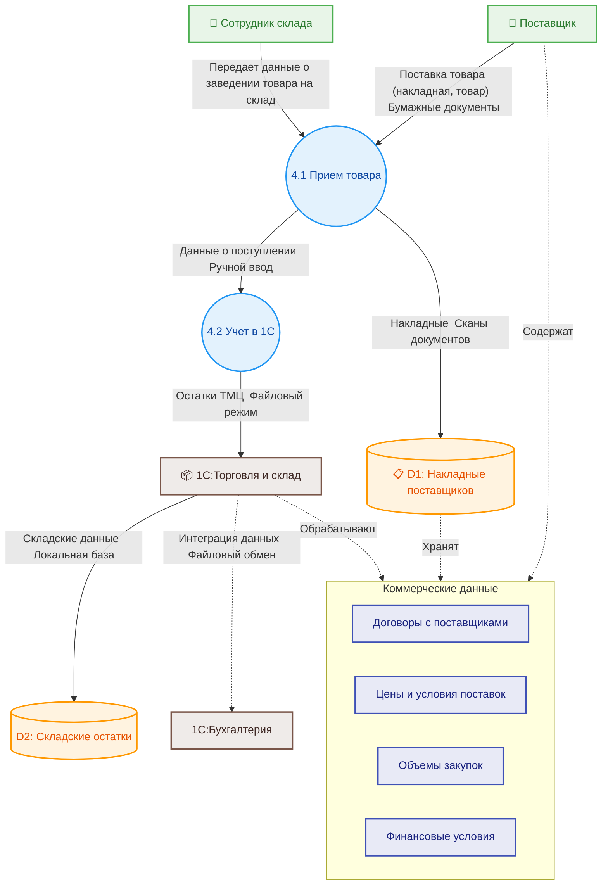
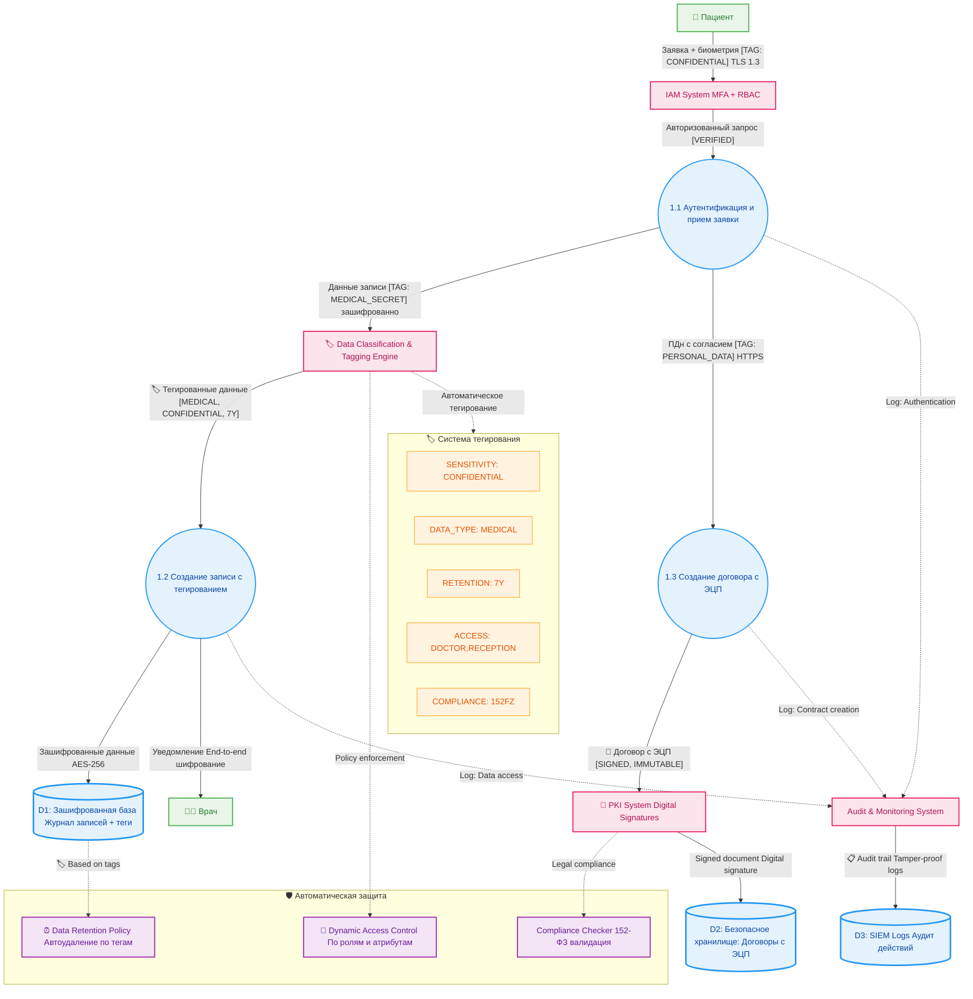
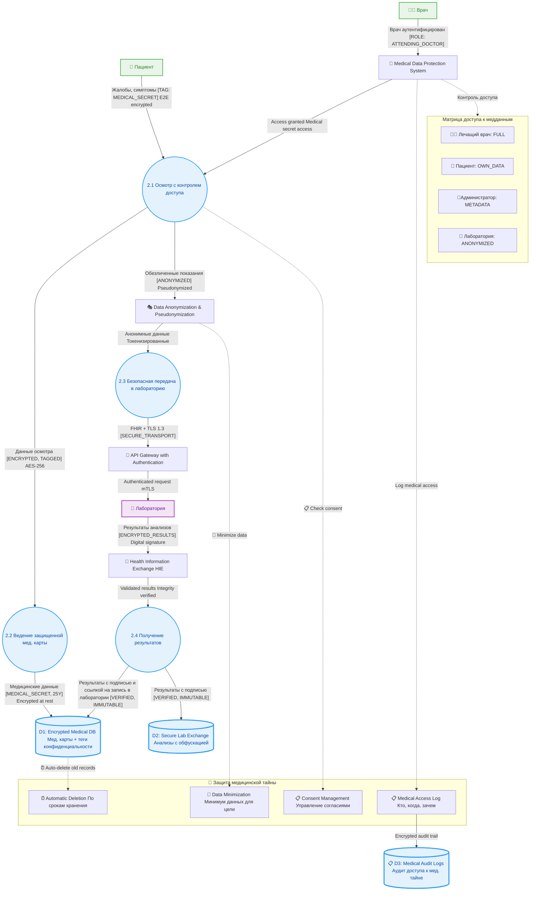
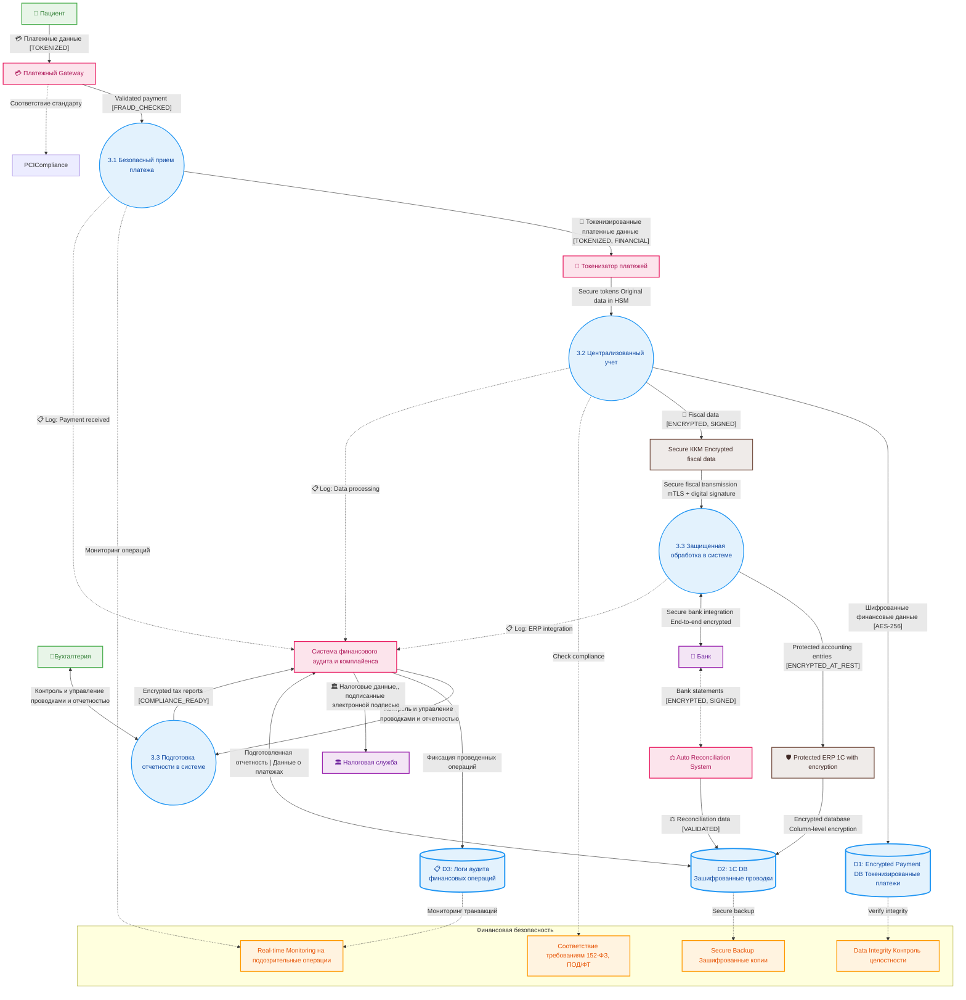

# Задание 1. Анализ безопасности системы

Чтобы заниматься реализацией новых продуктов, которые основаны на данных, необходимо системно решить проблему хранения конфиденциальных данных и управления ими. Сейчас данные лежат в непосредственной близости к пользователям, поэтому существует риск утечки данных и неправомерного использования информации.
Чтобы защитить данные, используйте механизмы, инструменты и принципы работы с конфиденциальными данными, например, подходы Privacy By Design, Data Minimization и Data Lineage.
В рамках этого задания вам нужно проанализировать состояние As-Is, чтобы впоследствии приступить к его доработке.

## Что нужно сделать

1. Выявите конфиденциальные данные, которые не учтены во внутренних системах.

   - Проанализируйте информацию о компании.
   - Создайте диаграммы потоков данных (Data Flow Diagrams). Для каждого процесса создайте отдельную диаграмму.
   - Отобразите на них, как данные перемещаются по системам компании и какие операции над ними совершают.

2. Проведите аудит мер по обеспечению безопасности данных.

   - Сопоставьте процессы в компании с требованиями по обеспечению безопасности данных и архитектурными практиками в области безопасности конфиденциальных данных.
   - Составьте список проблемных зон и сохраните его в отдельный документ.

3. Подумайте, что можно улучшить.

   - Составьте список данных для защиты и проставьте для каждого способы защиты — шифрование, обфускация, обезличивание.
   - Разработайте механизм тегирования данных с использованием инструментов тегирования.
   - Составьте список инструментов, способов и мер, которые позволят обеспечить конфиденциальность данных в указанных потоках.
   - Доработайте диаграммы из предыдущего шага: отобразите на них, что следует использовать на каждом этапе потока.

При работе над диаграммами потоков данных ориентируйтесь на рекомендации, которые мы дали в уроке «Как управлять потоками данных», и гайд от Lucidchard.
Когда задание будет готово, загрузите диаграммы потоков данных и список проблем в директорию Task1 в рамках пул-реквеста.

# Решение. Анализ безопасности системы "Медикаменте"

## 1. Выявление конфиденциальных данных

### Анализ текущего состояния компании

Компания "Медикаменте" обрабатывает следующие категории конфиденциальных данных:

#### Персональные данные пациентов (PII)

- Базовые персональные данные: ФИО, дата рождения, телефон, электронная почта
- Расширенные персональные данные: адрес прописки, место работы/учебы
- Медицинские данные: информация о хронических заболеваниях, результаты анализов, медицинские заключения
- Договорная информация: клиентские контракты, условия обслуживания

#### Финансовые данные

- Платежная информация: данные о платежах пациентов
- Бухгалтерские данные: налоговая отчетность
- Кадровые данные: информация о зарплатах сотрудников

#### Операционные данные

- Данные о сотрудниках: личные данные, должностные обязанности
- Складские данные: информация о ТМЦ, поставщиках
- Системные данные: логи доступа, конфигурации систем

### Проблемы текущего состояния

1. **Отсутствие централизованного управления данными**
   - Данные разбросаны по разным системам (Excel, 1C, файловые хранилища)
   - Нет единой системы классификации и тегирования данных

2. **Недостаточная защита данных при хранении**
   - Файлы Excel и сканы документов хранятся на общем диске без шифрования
   - Отсутствует контроль доступа к конфиденциальным данным

3. **Отсутствие аудита и мониторинга**
   - Нет логирования доступа к данным
   - Отсутствует система отслеживания изменений в данных

4. **Слабая защита при передаче данных**
   - Внутренние потоки данных не контролируются
   - Отсутствует шифрование при передаче данных между системами

### Диаграммы потоков данных (DFD)

#### Процесс 1: Запись пациента на прием

**Конфиденциальные данные в потоке:**
- ФИО пациента
- Контактная информация
- Медицинские показания
- Договорная информация

**Проблемы безопасности:**
- Данные хранятся в незашифрованном виде
- Отсутствует контроль доступа
- Нет аудита изменений

#### Процесс 2: Проведение медицинского осмотра и ведение медицинской карты

**Конфиденциальные данные в потоке:**

- Медицинские данные пациента
- Результаты обследований
- Диагнозы и назначения
- Результаты анализов

**Проблемы безопасности:**

- Медицинские данные хранятся в открытом виде
- Отсутствует шифрование при передаче в лабораторию
- Нет контроля доступа к медицинским картам

#### Процесс 3: Обработка платежей

**Конфиденциальные данные в потоке:**

- Платежная информация
- Персональные данные плательщика
- Финансовые операции

**Проблемы безопасности:**

- Дублирование данных в разных системах
- Отсутствует шифрование платежных данных
- Нет централизованного аудита финансовых операций

#### Процесс 4: Управление складом и ТМЦ

**Конфиденциальные данные в потоке:**

- Договорная информация с поставщиками
- Финансовые данные о закупках
- Данные о медицинском оборудовании

**Проблемы безопасности:**

- Отсутствует защита коммерческой информации
- Нет контроля доступа к данным о поставщиках

## 2. Аудит мер по обеспечению безопасности данных

### Соответствие требованиям российского законодательства

#### Федеральный закон "О персональных данных" (152-ФЗ)

- Отсутствует согласие на обработку персональных данных
- Нет уведомления Роскомнадзора об обработке ПДн
- Отсутствуют технические меры защиты ПДн
- Нет назначенного ответственного за обработку ПДн

#### Федеральный закон "Об охране здоровья граждан" (323-ФЗ)

- Медицинская тайна не защищена должным образом
- Отсутствует контроль доступа к медицинским данным
- Нет системы аудита доступа к медицинской информации

#### Требования по информационной безопасности

- Отсутствует классификация информации по уровням конфиденциальности
- Нет политики информационной безопасности
- Отсутствует система управления инцидентами ИБ

### Архитектурные практики безопасности

#### Privacy by Design

- Безопасность не заложена в основу архитектуры
- Отсутствует принцип минимизации данных
- Нет встроенной приватности по умолчанию

#### Data Minimization

- Собираются избыточные данные
- Отсутствует политика удаления данных
- Нет ограничений на время хранения данных

#### Data Lineage

- Отсутствует отслеживание происхождения данных
- Нет визуализации потоков данных
- Отсутствует документирование трансформаций данных

### Список проблемных зон

### Критические проблемы

1. Отсутствие шифрования данных - данные хранятся в открытом виде
2. Слабый контроль доступа - любой сотрудник может получить доступ к любым данным
3. Отсутствие аудита - нет логирования доступа к конфиденциальным данным
4. Несоответствие 152-ФЗ - высокий риск штрафов и репутационных потерь

### Высокие риски

1. Утечка медицинских данных - нарушение врачебной тайны
2. Компрометация платежных данных - финансовые риски
3. Нарушение целостности данных - возможность несанкционированного изменения
4. Отсутствие резервного копирования - риск потери данных

### Средние риски

1. Неэффективное управление данными - избыточное дублирование
2. Слабая интеграция систем - риск рассинхронизации данных
3. Отсутствие мониторинга - невозможность выявления инцидентов

## 3. Рекомендации по улучшению

### Классификация данных для защиты

| Тип данных | Уровень конфиденциальности | Способ защиты |
|------------|---------------------------|---------------|
| Медицинские данные | Критический | Шифрование AES-256, обфускация |
| Персональные данные | Высокий | Шифрование, псевдонимизация |
| Платежная информация | Высокий | Шифрование, токенизация |
| Договорная информация | Средний | Шифрование, контроль доступа |
| Операционные данные | Низкий | Контроль доступа, аудит |

### Механизм тегирования данных

#### Предлагаемые теги

- **Sensitivity**: PUBLIC, INTERNAL, CONFIDENTIAL, RESTRICTED
- **DataType**: MEDICAL, PERSONAL, FINANCIAL, OPERATIONAL
- **Retention**: 1Y, 3Y, 7Y, PERMANENT
- **Access**: DOCTOR, ADMIN, RECEPTION, CASHIER
- **Compliance**: GDPR, 152FZ, MEDICAL_SECRET

#### Инструменты тегирования

- **Apache Atlas** - для управления метаданными (вероятно лучшее для РФ)
- **Собственное решение** - на базе аннотаций в базе данных

### Инструменты и меры защиты

#### Шифрование данных

- **At Rest**: AES-256 для файлов, TDE для БД
- **In Transit**: TLS 1.3 для сетевого трафика
- **In Use**: Homomorphic encryption для аналитики

#### Контроль доступа

- **RBAC** - ролевое управление доступом
- **ABAC** - атрибутное управление доступом
- **MFA** - многофакторная аутентификация

#### Мониторинг и аудит

- **SIEM** - система управления событиями безопасности
- **DLP** - предотвращение утечек данных
- **Database Activity Monitoring** - мониторинг активности БД

#### Управление ключами

- **Key Management System** - централизованное управление ключами
- **Hardware Security Module** - аппаратная защита ключей

### Архитектурные изменения

#### Новые компоненты архитектуры

- **Data Governance Platform** - платформа управления данными
- **Privacy Management System** - система управления приватностью
- **Audit and Compliance System** - система аудита и соответствия
- **Identity and Access Management** - система управления идентификацией
- **Data Loss Prevention** - система предотвращения утечек

### Обновленные диаграммы

#### Запись пациента с мерами защиты

#### Медицинский осмотр с защитой тайны пациента

### Обработка платежей с защитой

## Заключение

Текущее состояние системы безопасности в компании "Медикаменте" не соответствует требованиям российского законодательства и современным стандартам защиты конфиденциальных данных. Необходимо комплексное решение проблем безопасности с внедрением современных технологий защиты данных и приведением процессов в соответствие с принципами Privacy by Design.

Приоритетные шаги:

1. Внедрение системы классификации и тегирования данных
2. Реализация шифрования данных при хранении и передаче
3. Внедрение системы контроля доступа и аудита
4. Приведение процессов в соответствие с требованиями 152-ФЗ
5. Обучение персонала основам информационной безопасности
